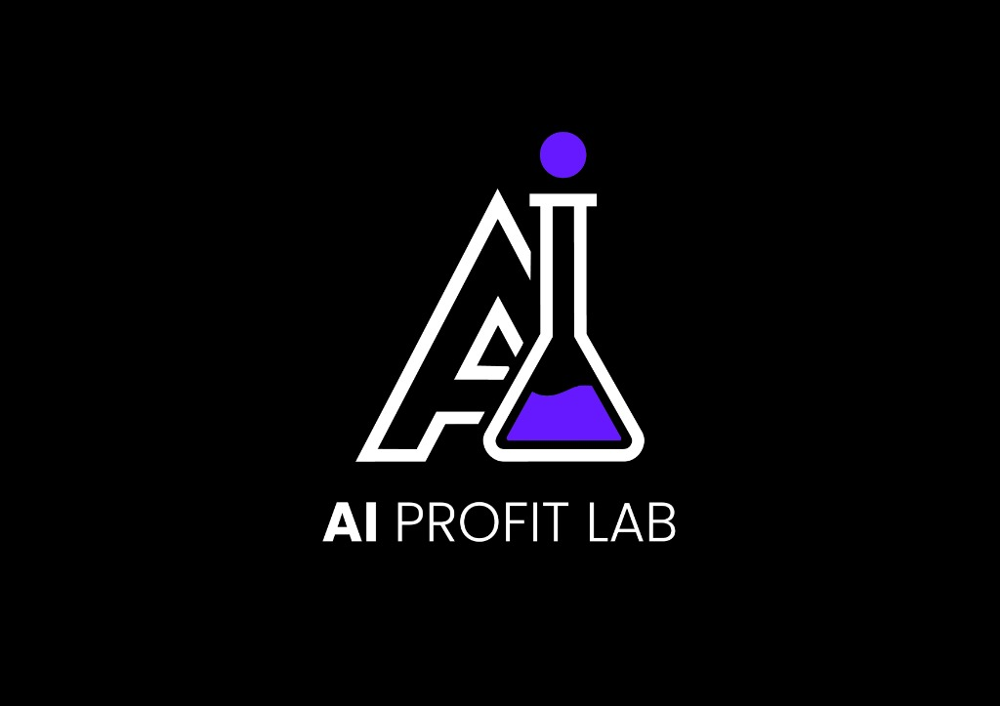

# Profit Lab Skill Builder 🧪

A premium, student-focused web application for transforming **Custom GPTs** into **Claude Code** compatible agent skills.



## 🚀 Overview

The **Profit Lab Skill Builder** allows you to port your logic from ChatGPT directly into local developer environments. In less than 30 seconds, you can "synthesize" your GPT instructions into a portable `.claude/skills/` package, ready for autonomous execution in Claude Code.

### ✨ Features

- **Premium Lab Aesthetic**: Modern glassmorphism UI with vibrant purple accents.
- **Claude Code Ready**: Generates standardized `SKILL.md` files with necessary YAML frontmatter.
- **One-Click Synthesis**: Package metadata, instructions, and resources into a single ZIP.
- **Student Optimized**: Simplified 3-step workflow (Metadata → Instructions → Synthesis).

## 🛠️ Tech Stack

- **Vite**: Ultra-fast development and build pipeline.
- **Vanilla JS/CSS**: High performance with zero complex overhead.
- **JSZip**: Client-side package generation.
- **Inter & JetBrains Mono**: Professional typography for enhanced readability.

## 📦 Getting Started

### Prerequisites

- [Node.js](https://nodejs.org/) (v18 or higher)
- [npm](https://www.npmjs.com/)

### Installation

1. Clone the repository:
   ```bash
   git clone https://github.com/your-username/profit-lab-skill-builder.git
   cd profit-lab-skill-builder
   ```

2. Install dependencies:
   ```bash
   npm install
   ```

3. Run the development server:
   ```bash
   npm run dev
   ```

## 🏗️ Building for Production

To create a production-ready bundle:

```bash
npm run build
```

The output will be in the `dist/` directory.

## 🎓 For Students

This tool is designed to work with the **AI Profit Lab** curriculum. Use it to bring your Custom GPTs to life as native agent skills in your local coding projects.

---

*Built with ❤️ for the AI Profit Lab community.*
